Uncorrelated feature encoding for faster style transfer
==

**Unofficial Pytorch Implementation of ['Uncorrelated feature encoding for faster style transfer'](https://doi.org/10.1016/j.neunet.2021.03.007)**

```Text
This repository implements the above paper based on vgg19. Please refer to scripts.sh for differences in details.
```

# Usage
* Requirements
  * torch (version: 1.13.0)
  * torchvision (version: 0.14.0)
  * wandb

* Dataset
  * Content Image: [MSCOCO 2014](https://cocodataset.org/#download) (train2014 for train, test2014 for test)
  * Style Image: [Painter By Numbers](https://www.kaggle.com/competitions/painter-by-numbers/data)

# Result
### Training Loss
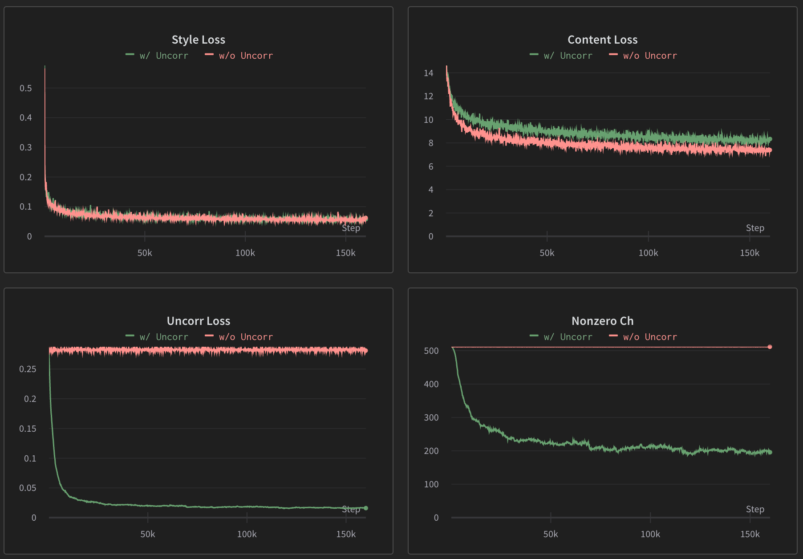
*(From the top left to the bottom right.) style loss, content loss, uncorrelation loss and number of nonzero channels from the feature map.  More details: [wandb link](https://api.wandb.ai/links/minssi/bzxc3jqs).*

### Correlation Matrix
Correlation matrix of the feature map extracted from the vgg encoder calculated by the test data. The feature map has 512 channels, and the matrix is normalized to the total number of images.

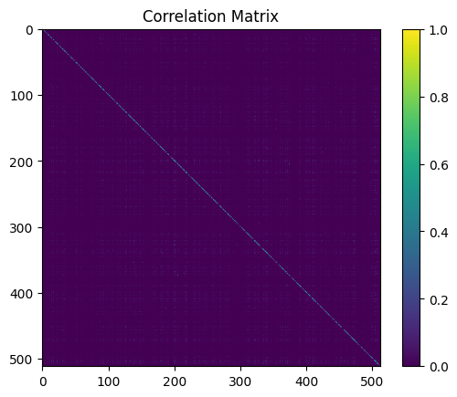


### Stylization with channel pruning

The value of accumulating and sorting the absolute values of the channel vectors.
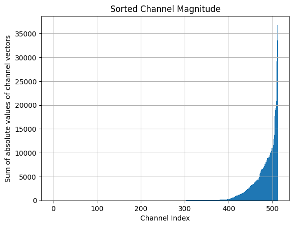

The stylization result of the network pruning the channels in the above order of magnitude.
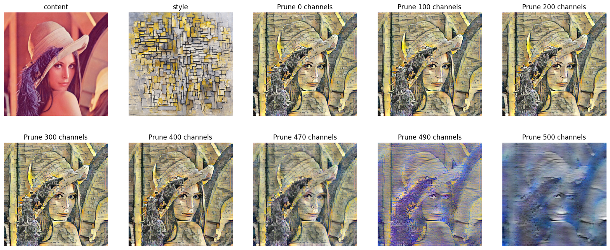

**The above results were calculated through the jupyter notebook.**

### Stylization Result
| Content | Style | w/o Uncorrealtion Loss | w/ Uncorrealtion Loss |
| --- | --- | --- | --- |
| 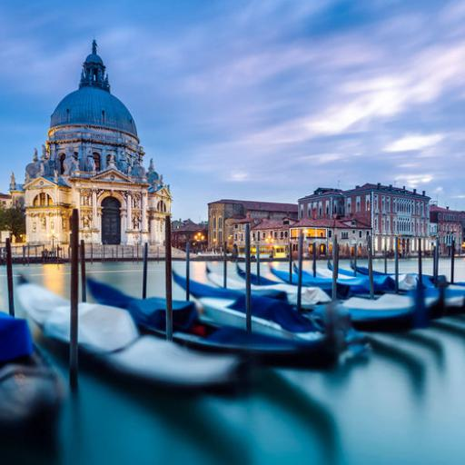 | 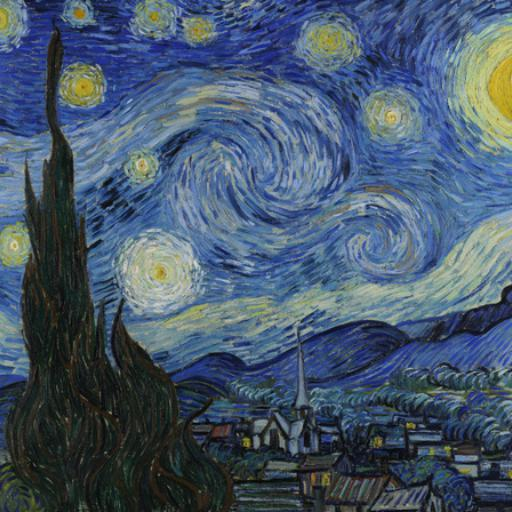 | 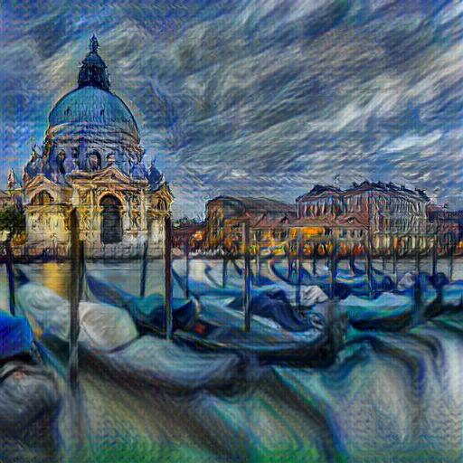 | 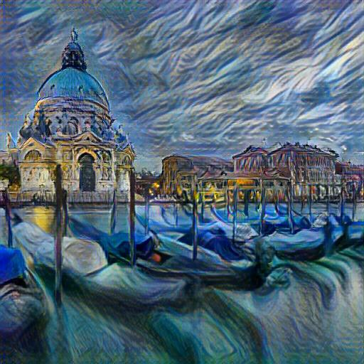 |
| 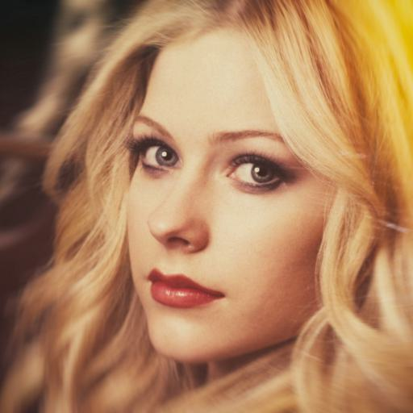 | 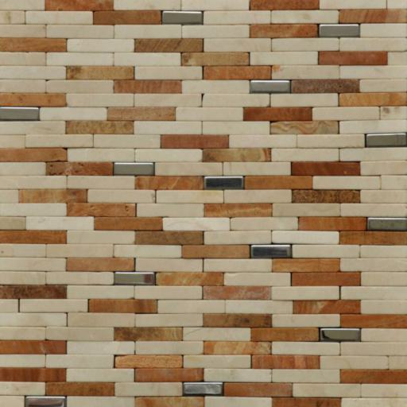 | 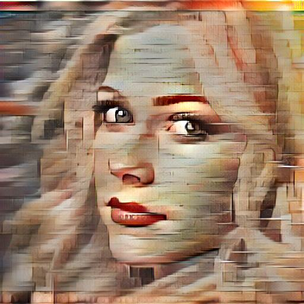 | 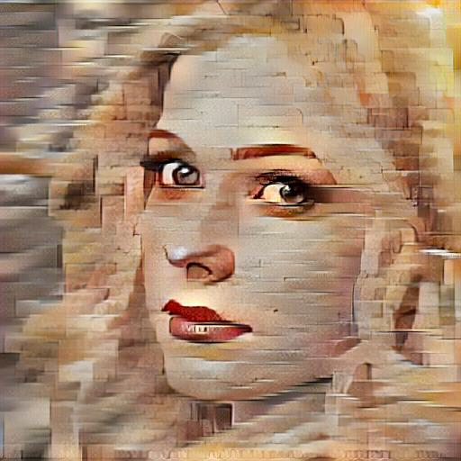 |
| 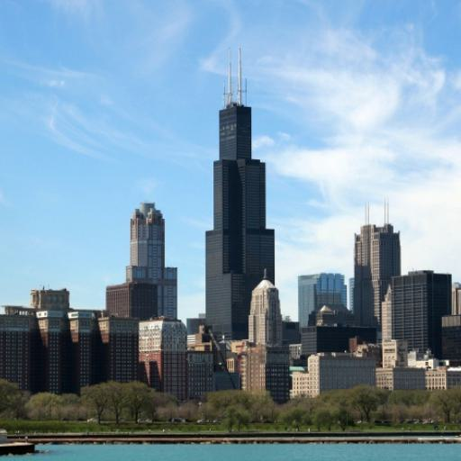 | 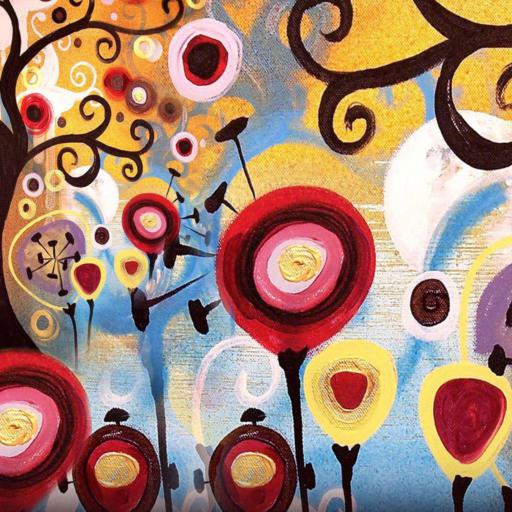 | 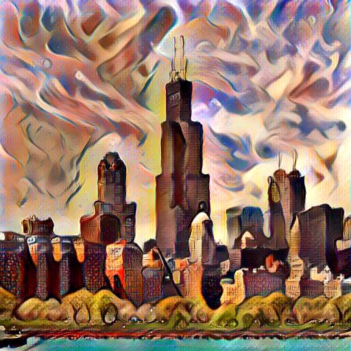 | 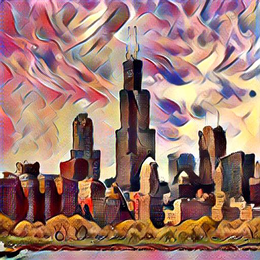 |
